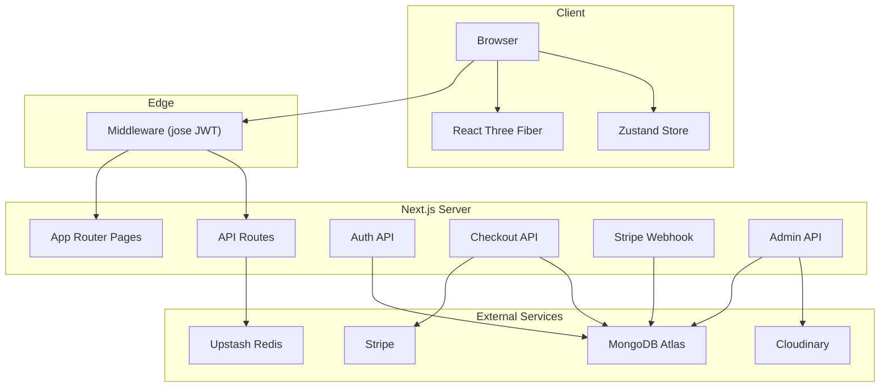
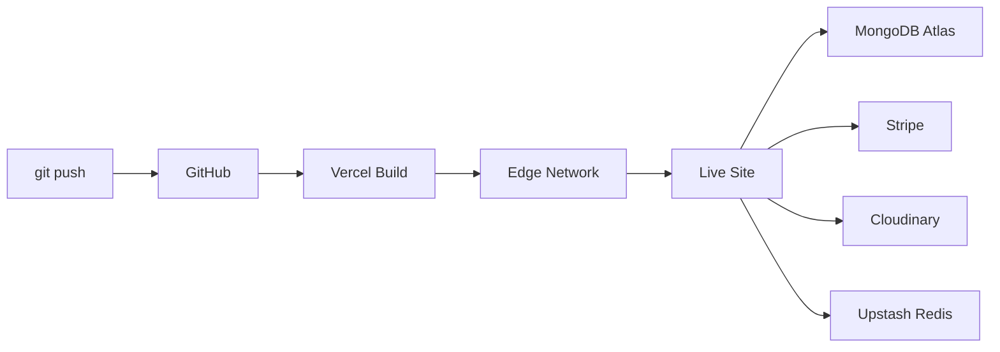

<p align="center">
  <strong>🪐 GRAVITY SHOP</strong>
</p>

<p align="center">
  A full-stack 3D e-commerce platform built with Next.js, Three.js, and Stripe.
</p>

<p align="center">
  
  
  
  
  
  
  
</p>

---

## Overview

Gravity Shop is a production-grade e-commerce storefront that combines WebGL-powered 3D product visualization with a complete checkout and admin management system. Customers browse products rendered in interactive 3D scenes, add items to a cart, and complete purchases through Stripe Checkout. Administrators manage products, users, orders, inventory, and store settings through a protected dashboard.

The application is server-rendered with Next.js 14 App Router, backed by MongoDB Atlas, and secured with JWT authentication verified cryptographically at the Edge middleware layer.

---

## Features

### Customer Experience
- **3D Product Visualization** — Interactive product scenes built with React Three Fiber and Drei
- **Product Browsing** — Grid layout with category filtering and real-time search
- **Search Palette** — Command-palette-style search with keyboard navigation (`Ctrl+K`)
- **Shopping Cart** — Slide-out cart drawer with quantity management and live totals
- **Cart Animations** — Fly-to-cart micro-animations using Framer Motion
- **Stripe Checkout** — Secure payment flow via Stripe Checkout Sessions
- **User Accounts** — Registration, login, and order history
- **Responsive Design** — Glassmorphism UI with gradient backgrounds and dark theme

### Admin Dashboard
- **Product Management** — Create, edit, and delete products with image and 3D model uploads
- **Inventory Control** — Real-time stock levels with low-stock alerts
- **Order Management** — View, filter, and update order statuses
- **User Management** — Search, paginate, toggle roles, activate/deactivate accounts
- **Analytics** — Revenue charts, top-selling products, monthly trends (Recharts)
- **Store Settings** — Business configuration persisted to MongoDB

### Security
- **JWT Authentication** — Issued on login/register, stored as HTTP-only cookies
- **Edge Middleware Protection** — Cryptographic JWT verification via `jose` on all `/admin` routes
- **Webhook Signature Validation** — Stripe webhook payloads verified with `constructEvent()`
- **Rate Limiting** — Sliding-window limiter on sensitive endpoints via Upstash Redis
- **Password Hashing** — bcrypt with salt rounds

### Commerce
- **Stripe Checkout Sessions** — Server-side session creation with line items from database
- **Webhook Fulfillment** — Automatic order status transition and inventory decrement on payment
- **Atomic Transactions** — MongoDB transactions wrap fulfillment to prevent partial updates
- **Idempotent Processing** — Duplicate webhook deliveries are safely ignored

---

## Tech Stack

| Layer | Technology | Purpose |
|-------|-----------|---------|
| Framework | Next.js 14 (App Router) | Server/client rendering, API routes, middleware |
| Language | TypeScript 5 | Type safety across the stack |
| UI Library | React 18 | Component architecture |
| 3D Engine | Three.js + React Three Fiber + Drei | WebGL product visualization |
| Animation | Framer Motion + GSAP | Page transitions and micro-animations |
| Styling | Tailwind CSS 3 | Utility-first CSS |
| State | Zustand | Client-side cart and auth state |
| Database | MongoDB Atlas + Mongoose 9 | Document storage and ODM |
| Payments | Stripe SDK | Checkout sessions and webhook processing |
| Media | Cloudinary | Image and 3D model (GLB) hosting |
| Cache | Upstash Redis | Rate limiting |
| Auth | jsonwebtoken + jose + bcryptjs | Token signing, edge verification, password hashing |
| Charts | Recharts | Admin analytics visualization |
| Icons | Lucide React | UI iconography |

---

## Architecture



---

## Project Structure

```
gravity-shop/
├── app/
│   ├── (admin)/                  # Admin route group
│   │   ├── analytics/page.tsx    # Revenue & sales dashboard
│   │   ├── inventory/page.tsx    # Stock management
│   │   ├── orders/page.tsx       # Order management
│   │   ├── products/page.tsx     # Product CRUD
│   │   ├── settings/page.tsx     # Store configuration
│   │   ├── users/page.tsx        # User management
│   │   ├── layout.tsx            # Admin sidebar layout
│   │   └── page.tsx              # Admin dashboard home
│   ├── (user)/
│   │   ├── account/page.tsx      # User profile & orders
│   │   └── layout.tsx
│   ├── api/
│   │   ├── admin/
│   │   │   ├── analytics/        # GET aggregated stats
│   │   │   ├── inventory/        # GET/PATCH stock levels
│   │   │   ├── orders/           # GET/PATCH orders
│   │   │   ├── products/         # GET/POST products
│   │   │   ├── settings/         # GET/PUT store settings
│   │   │   ├── upload/           # POST file uploads
│   │   │   └── users/            # GET users, PATCH user by ID
│   │   ├── auth/
│   │   │   ├── login/            # POST credentials
│   │   │   └── register/         # POST new account
│   │   ├── checkout/             # POST Stripe session
│   │   ├── health/               # GET service status
│   │   ├── products/             # GET public products
│   │   ├── search/               # GET search results
│   │   └── webhooks/stripe/      # POST Stripe events
│   ├── product/[id]/page.tsx     # Product detail page
│   ├── layout.tsx                # Root layout
│   ├── page.tsx                  # Homepage
│   ├── robots.ts                 # SEO robots
│   └── sitemap.ts                # SEO sitemap
├── components/
│   ├── admin/                    # AdminSidebar, ProductDataGrid, ProductUploadModal, GlowingChart
│   ├── animations/               # CartFlyAnimation
│   ├── auth/                     # AuthModal
│   ├── canvas/                   # Scene, FloatingProduct, Environment
│   ├── cart/                     # CartDrawer, CartItemCard, CartScene, CartSummary
│   ├── product/                  # ProductCard3D, ProductGrid, ProductDetails, ProductViewer, etc.
│   └── ui/                       # Navbar, Hero, SearchPalette, GlassPanel, MagneticCursor, FloatingGradientBackground
├── lib/
│   ├── db/connect.ts             # MongoDB connection singleton
│   ├── models/
│   │   ├── User.ts               # User schema (name, email, password, role, isActive)
│   │   ├── Product.ts            # Product schema (name, slug, price, stock, images, model3d)
│   │   ├── Order.ts              # Order schema (items, status, stripeSessionId)
│   │   └── Setting.ts            # Settings schema (key-value store by category)
│   ├── api-error.ts              # Structured error handling
│   ├── cloudinary.ts             # Upload helper
│   ├── env.ts                    # Environment validation
│   ├── logger.ts                 # Server-side logger
│   └── rate-limit.ts             # Upstash rate limiter
├── store/
│   └── useAppStore.ts            # Zustand store (cart, auth, UI state)
├── middleware.ts                 # Edge JWT verification for /admin routes
├── next.config.mjs
├── tailwind.config.ts
├── tsconfig.json
└── package.json
```

---

## Installation

```bash
# Clone the repository
git clone https://github.com/ashish7802/Gravity-Shop.git
cd Gravity-Shop

# Install dependencies
npm install --legacy-peer-deps
```

> **Note:** The `--legacy-peer-deps` flag is required due to peer dependency conflicts between React 18 and `@react-three/drei`.

---

## Environment Variables

Create a `.env.local` file in the project root with the following variables:

```env
# MongoDB
MONGODB_URI=

# Authentication
JWT_SECRET=

# Stripe
NEXT_PUBLIC_STRIPE_PUBLISHABLE_KEY=
STRIPE_SECRET_KEY=
STRIPE_WEBHOOK_SECRET=

# Cloudinary
CLOUDINARY_CLOUD_NAME=
CLOUDINARY_API_KEY=
CLOUDINARY_API_SECRET=

# Upstash Redis
UPSTASH_REDIS_REST_URL=
UPSTASH_REDIS_REST_TOKEN=
```

> **⚠️ Important:** Never commit `.env.local` to version control. The `.gitignore` already excludes it.

---

## Running Locally

```bash
# Start the development server
npm run dev
```

Open [http://localhost:3000](http://localhost:3000) in your browser.

---

## Production Build

```bash
# Build for production
npm run build

# Start the production server
npm start
```

---

## Stripe Setup

1. Create a [Stripe account](https://dashboard.stripe.com/register).
2. Copy your **Publishable Key** and **Secret Key** from the Stripe Dashboard → Developers → API Keys.
3. Set up a webhook endpoint pointing to `https://your-domain.com/api/webhooks/stripe`.
4. Subscribe to the `checkout.session.completed` event.
5. Copy the **Webhook Signing Secret** and add it to `STRIPE_WEBHOOK_SECRET`.

```bash
# For local testing with Stripe CLI
stripe listen --forward-to localhost:3000/api/webhooks/stripe
```

---

## Cloudinary Setup

1. Create a [Cloudinary account](https://cloudinary.com/users/register_free).
2. Navigate to Dashboard → Settings → Access Keys.
3. Copy `Cloud Name`, `API Key`, and `API Secret` into your environment variables.
4. Product images upload to `gravity-shop/images/`.
5. 3D models (GLB files) upload to `gravity-shop/models/`.

---

## MongoDB Setup

1. Create a [MongoDB Atlas](https://www.mongodb.com/cloud/atlas) cluster.
2. Create a database user with read/write permissions.
3. Whitelist your IP address (or use `0.0.0.0/0` for development).
4. Copy the connection string into `MONGODB_URI`.
5. The application automatically creates these collections on first use:
   - `users`
   - `products`
   - `orders`
   - `settings`

---

## Admin Dashboard

Access the admin dashboard at `/admin` after logging in with an admin account.

To create the first admin user, register a normal account and then update the role directly in MongoDB:

```javascript
db.users.updateOne(
  { email: "your-email@example.com" },
  { $set: { role: "admin" } }
)
```

### Admin Pages

| Page | Route | Functionality |
|------|-------|---------------|
| Dashboard | `/admin` | Overview with quick stats |
| Products | `/admin/products` | CRUD with image/model uploads |
| Inventory | `/admin/inventory` | Stock levels and low-stock alerts |
| Orders | `/admin/orders` | Status management and filtering |
| Users | `/admin/users` | Search, pagination, role toggle, activation |
| Analytics | `/admin/analytics` | Revenue charts, top products, trends |
| Settings | `/admin/settings` | Store, payment, media, email config |

---

## API Routes

| Method | Endpoint | Auth | Description |
|--------|----------|------|-------------|
| `POST` | `/api/auth/register` | Public | Create a new user account |
| `POST` | `/api/auth/login` | Public | Authenticate and receive JWT |
| `GET` | `/api/products` | Public | List all products |
| `GET` | `/api/search` | Public | Full-text product search |
| `POST` | `/api/checkout` | User | Create a Stripe Checkout Session |
| `POST` | `/api/webhooks/stripe` | Stripe | Handle payment webhooks |
| `GET` | `/api/health` | Public | Service connectivity status |
| `GET` | `/api/admin/products` | Admin | List products (admin view) |
| `POST` | `/api/admin/products` | Admin | Create a new product |
| `GET` | `/api/admin/orders` | Admin | List all orders |
| `PATCH` | `/api/admin/orders` | Admin | Update order status |
| `GET` | `/api/admin/inventory` | Admin | Get inventory levels |
| `PATCH` | `/api/admin/inventory` | Admin | Update stock quantities |
| `GET` | `/api/admin/users` | Admin | List users with pagination |
| `PATCH` | `/api/admin/users/[id]` | Admin | Update user role or status |
| `GET` | `/api/admin/analytics` | Admin | Aggregated business metrics |
| `GET` | `/api/admin/settings` | Admin | Read store settings |
| `PUT` | `/api/admin/settings` | Admin | Update store settings |
| `POST` | `/api/admin/upload` | Admin | Upload images or 3D models |

---

## Security

### Authentication Flow
1. User submits credentials to `/api/auth/login`.
2. Server verifies password hash with bcrypt.
3. Server signs a JWT containing `userId`, `email`, and `role`.
4. Token is returned and stored as an HTTP-only cookie.

### Middleware Protection
All routes matching `/admin/*` and `/api/admin/*` are intercepted by Edge Middleware that:
- Extracts the JWT from cookies
- Cryptographically verifies the signature using `jose` (`jwtVerify`)
- Validates token expiration
- Checks that `role === "admin"`
- Returns `401` or `403` for unauthorized requests

### Webhook Security
Stripe webhook payloads are verified using `stripe.webhooks.constructEvent()` with the webhook signing secret before any database mutations occur.

### Rate Limiting
Sensitive endpoints are protected by a sliding-window rate limiter (10 requests / 10 seconds) powered by Upstash Redis.

---

## Performance Optimizations

- **Dynamic Imports** — Three.js canvas components are loaded with `next/dynamic` to avoid blocking initial page render
- **Lazy 3D Engine** — The WebGL renderer only initializes when 3D components scroll into view
- **MongoDB Connection Pooling** — Singleton connection pattern prevents connection exhaustion in serverless
- **Aggregation Pipelines** — Analytics queries use `$lookup` instead of per-document queries
- **Atomic Transactions** — Stripe fulfillment uses `mongoose.startSession()` with `withTransaction()` to prevent partial writes
- **Image Optimization** — Product images served through Cloudinary CDN with automatic format selection
- **SEO** — Auto-generated `robots.txt` and `sitemap.xml` routes

---

## Deployment

### Vercel (Recommended)

1. Push the repository to GitHub.
2. Import the project in [Vercel](https://vercel.com).
3. Set the **Install Command** to `npm install --legacy-peer-deps`.
4. Add all environment variables in Vercel Project Settings.
5. Deploy.



### Post-Deployment

- Register a Stripe webhook endpoint pointing to `https://your-domain.vercel.app/api/webhooks/stripe`.
- Subscribe to `checkout.session.completed`.
- Update `STRIPE_WEBHOOK_SECRET` with the production signing secret.

---

## Screenshots

> Screenshots of the storefront, product pages, and admin dashboard can be added here.

| View | Screenshot |
|------|-----------|
| Homepage | *Coming soon* |
| Product Detail (3D) | *Coming soon* |
| Cart Drawer | *Coming soon* |
| Admin Dashboard | *Coming soon* |
| Admin Products | *Coming soon* |
| Admin Analytics | *Coming soon* |

---

## Known Limitations

- **No Email Notifications** — Order confirmations and shipping updates are not sent via email. The settings page includes an email configuration section for future integration.
- **No Guest Checkout** — Users must register or log in before purchasing.
- **No Wishlist** — There is no saved-items or favorites feature.
- **No Multi-Currency** — Stripe sessions are created in a single currency.
- **No Image Cropping** — Uploaded images are stored as-is without client-side cropping.
- **GLB Model Dependency** — 3D product previews require a GLB model URL in the product record; products without one display a static image fallback.

---

## Roadmap

- [ ] Email notifications via SendGrid or Resend
- [ ] Guest checkout flow
- [ ] Wishlist and saved items
- [ ] Product reviews and ratings
- [ ] Multi-currency support
- [ ] Order tracking with shipping integration
- [ ] Bulk product import (CSV)
- [ ] Client-side image cropping before upload

---

## License

This project is licensed under the [MIT License](LICENSE).

---

<p align="center">
  Built with Next.js, Three.js, and Stripe
</p>
