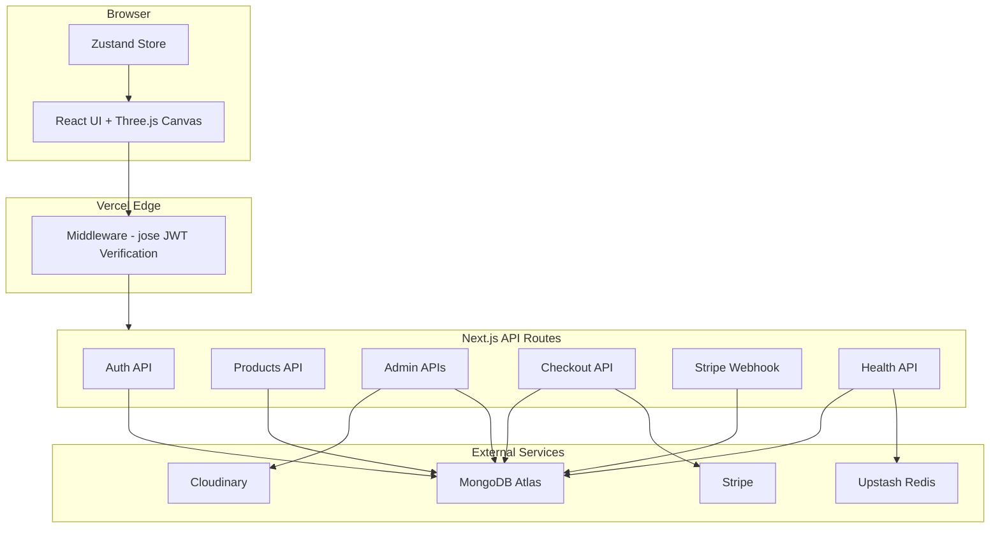
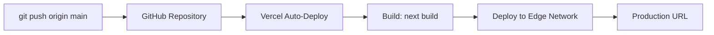

<](https://nextjs.org/)
[](https://www.typescriptlang.org/)
[](https://www.mongodb.com/atlas)
[](https://stripe.com/)
[](https://threejs.org/)
[](LICENSE)

[Live Demo](#deployment) · [Features](#features) · [Installation](#installation) · [API Reference](#api-routes)

</div>

---

## Overview

Gravity Shop is a full-stack e-commerce application that combines a WebGL-powered 3D storefront with a complete admin dashboard, real payment processing, and cloud-based media management. Products are displayed in an interactive Three.js canvas with floating animations, glassmorphism UI panels, and cinematic lighting — while the backend handles authentication, inventory tracking, order fulfillment, and webhook-driven payment verification.

This is not a template or a demo. It is a production-grade commerce platform with real Stripe checkout sessions, real MongoDB persistence, real Cloudinary uploads, and real Redis rate limiting.

---

## Features

### 🛒 Customer Features
- Interactive 3D product showcase with orbital camera controls
- Product detail pages with image galleries and add-to-cart
- Full-text product search with instant results
- Slide-out cart drawer with quantity management
- Stripe Checkout integration for secure payments
- User registration and JWT-based authentication
- Order history and account management
- Responsive glassmorphism UI with dark mode aesthetics

### 🔧 Admin Dashboard
- **Products** — Create, edit, and delete products with image and 3D model uploads
- **Inventory** — Monitor stock levels and update quantities
- **Orders** — View all orders, filter by status, track fulfillment
- **Users** — Search users, manage roles (admin/user), activate/deactivate accounts
- **Analytics** — Total revenue, order count, monthly revenue chart, top sellers, low stock alerts
- **Settings** — Store configuration persisted to MongoDB

### 💳 Commerce Features
- Stripe Checkout session creation with real product line items
- Webhook-driven order fulfillment with signature verification
- Atomic inventory decrement inside MongoDB transactions
- Idempotent webhook processing to prevent duplicate fulfillment
- Order status lifecycle: `pending` → `paid` → `processing` → `shipped` → `delivered`

### 🎨 3D & Visual Features
- React Three Fiber canvas with custom environment lighting
- Floating product animations using GSAP and Framer Motion
- Magnetic cursor tracking effect
- Cart fly animation on add-to-cart
- Floating gradient background with particle effects
- Glass panel components with blur and transparency

### 🔐 Security Features
- Cryptographic JWT verification at the Edge middleware layer using `jose`
- Role-based route protection for all `/admin` and `/api/admin` paths
- Password hashing with `bcryptjs`
- Upstash Redis sliding-window rate limiting
- Stripe webhook signature validation
- No secrets stored in source code — all credentials via environment variables

---

## Tech Stack

| Layer | Technology |
|:------|:-----------|
| **Framework** | Next.js 14 (App Router) |
| **Language** | TypeScript 5 |
| **UI Library** | React 18 |
| **Styling** | Tailwind CSS 3 |
| **3D Engine** | Three.js + React Three Fiber + Drei |
| **Animation** | Framer Motion + GSAP |
| **State** | Zustand |
| **Database** | MongoDB Atlas + Mongoose 9 |
| **Payments** | Stripe (Checkout Sessions + Webhooks) |
| **Media** | Cloudinary (Images + 3D Models) |
| **Rate Limiting** | Upstash Redis |
| **Auth** | JWT (jsonwebtoken + jose) |
| **Icons** | Lucide React |
| **Charts** | Recharts |

---

## Architecture



---

## Project Structure

```
gravity-shop/
├── app/
│   ├── (admin)/                    # Admin route group
│   │   ├── layout.tsx              # Admin layout with sidebar
│   │   ├── page.tsx                # Admin dashboard
│   │   ├── analytics/page.tsx      # Revenue & sales analytics
│   │   ├── inventory/page.tsx      # Stock management
│   │   ├── orders/page.tsx         # Order management
│   │   ├── products/page.tsx       # Product CRUD
│   │   ├── settings/page.tsx       # Store settings
│   │   └── users/page.tsx          # User management
│   ├── (user)/                     # Customer route group
│   │   ├── layout.tsx              # Customer layout
│   │   └── account/page.tsx        # Account & order history
│   ├── api/
│   │   ├── admin/
│   │   │   ├── analytics/route.ts  # Aggregation pipeline analytics
│   │   │   ├── inventory/route.ts  # Stock updates
│   │   │   ├── orders/route.ts     # Order queries
│   │   │   ├── products/route.ts   # Product CRUD
│   │   │   ├── settings/route.ts   # Settings read/write
│   │   │   ├── upload/route.ts     # Cloudinary file upload
│   │   │   └── users/              # User management + [id] routes
│   │   ├── auth/
│   │   │   ├── login/route.ts      # JWT login
│   │   │   └── register/route.ts   # User registration
│   │   ├── checkout/route.ts       # Stripe session creation
│   │   ├── health/route.ts         # Service health check
│   │   ├── products/route.ts       # Public product listing
│   │   ├── search/route.ts         # Full-text search
│   │   └── webhooks/stripe/route.ts # Stripe webhook handler
│   ├── product/[id]/page.tsx       # Product detail page
│   ├── layout.tsx                  # Root layout
│   ├── page.tsx                    # Homepage
│   ├── robots.ts                   # SEO robots.txt
│   └── sitemap.ts                  # SEO sitemap.xml
├── components/
│   ├── admin/                      # AdminSidebar, ProductDataGrid, etc.
│   ├── animations/                 # CartFlyAnimation
│   ├── auth/                       # AuthModal (login/register)
│   ├── canvas/                     # Scene, FloatingProduct, Environment
│   ├── cart/                       # CartDrawer, CartItemCard, CartSummary
│   ├── product/                    # ProductGrid, ProductCard3D, ProductViewer
│   └── ui/                         # Navbar, Hero, SearchPalette, GlassPanel
├── lib/
│   ├── db/connect.ts               # MongoDB connection singleton
│   ├── models/                     # User, Product, Order, Setting schemas
│   ├── api-error.ts                # Standardized API error handling
│   ├── cloudinary.ts               # Upload helper
│   ├── env.ts                      # Environment variable validation
│   ├── logger.ts                   # Structured logging
│   └── rate-limit.ts               # Upstash rate limiter
├── store/
│   └── useAppStore.ts              # Zustand global state (cart, auth, UI)
├── middleware.ts                   # Edge JWT verification + route protection
├── next.config.mjs
├── tailwind.config.ts
├── tsconfig.json
└── package.json
```

---

## Installation

**Prerequisites:** Node.js 18+, npm

```bash
git clone https://github.com/ashish7802/Gravity-Shop.git
cd Gravity-Shop
npm install --legacy-peer-deps
```

> **Note:** The `--legacy-peer-deps` flag is required due to a peer dependency conflict between `@react-three/drei` (requires React 19) and the project's React 18 installation. This does not affect functionality.

---

## Environment Variables

Create a `.env.local` file in the project root with the following variables:

```env
# MongoDB
MONGODB_URI=your_mongodb_atlas_connection_string

# Authentication
JWT_SECRET=your_64_character_hex_secret

# Stripe
NEXT_PUBLIC_STRIPE_PUBLISHABLE_KEY=pk_test_...
STRIPE_SECRET_KEY=sk_test_...
STRIPE_WEBHOOK_SECRET=whsec_...

# Cloudinary
CLOUDINARY_CLOUD_NAME=your_cloud_name
CLOUDINARY_API_KEY=your_api_key
CLOUDINARY_API_SECRET=your_api_secret

# Upstash Redis
UPSTASH_REDIS_REST_URL=https://your-instance.upstash.io
UPSTASH_REDIS_REST_TOKEN=your_token
```

> **⚠️ Important:** Never commit `.env.local` to version control. The `.gitignore` is already configured to exclude all `.env*` files.

---

## Running Locally

```bash
npm run dev
```

Open [http://localhost:3000](http://localhost:3000).

---

## Production Build

```bash
npm run build
npm start
```

The build compiles 23 routes, runs TypeScript type checking and ESLint linting, generates static pages, and bundles the Edge middleware.

---

## Stripe Setup

1. Create a [Stripe](https://dashboard.stripe.com/) account.
2. Copy your **Publishable Key** and **Secret Key** from the Developers section.
3. Set up a webhook endpoint pointing to `https://your-domain.com/api/webhooks/stripe`.
4. Subscribe to the `checkout.session.completed` event.
5. Copy the **Webhook Signing Secret** to `STRIPE_WEBHOOK_SECRET`.

**How it works:**
- The checkout API creates a Stripe Checkout Session with product line items from the database.
- On successful payment, Stripe sends a `checkout.session.completed` event to the webhook.
- The webhook validates the signature, transitions the order to `paid`, and decrements inventory atomically inside a MongoDB transaction.

---

## Cloudinary Setup

1. Create a [Cloudinary](https://cloudinary.com/) account.
2. Copy your **Cloud Name**, **API Key**, and **API Secret** from the Dashboard.
3. The upload endpoint supports:
   - **Images** — up to 10MB (JPEG, PNG, WebP, GIF)
   - **3D Models** — up to 50MB (GLB, GLTF)
4. Files are organized into `gravity-shop/images` and `gravity-shop/models` folders.

---

## MongoDB Setup

1. Create a [MongoDB Atlas](https://www.mongodb.com/atlas) cluster.
2. Create a database user with read/write permissions.
3. Whitelist your IP address (or use `0.0.0.0/0` for Vercel).
4. Copy the connection string to `MONGODB_URI`.

**Models:**

| Model | Purpose |
|:------|:--------|
| `User` | Email, hashed password, role (user/admin), isActive flag |
| `Product` | Name, slug, price, stock, category, images, 3D model URL |
| `Order` | User reference, line items, total, status, Stripe session ID |
| `Setting` | Key-value store for business configuration (store, payment, email) |

---

## Admin Dashboard

Access the admin panel at `/admin`. Requires a user account with `role: "admin"`.

To promote a user to admin, update the document directly in MongoDB Atlas:

```javascript
db.users.updateOne(
  { email: "your@email.com" },
  { $set: { role: "admin" } }
)
```

**Dashboard Sections:**

| Section | Route | Capabilities |
|:--------|:------|:-------------|
| Dashboard | `/admin` | Overview with quick stats |
| Products | `/admin/products` | CRUD with image/model upload |
| Inventory | `/admin/inventory` | Stock levels, bulk updates |
| Orders | `/admin/orders` | Status tracking, filtering |
| Users | `/admin/users` | Search, role toggle, account activation |
| Analytics | `/admin/analytics` | Revenue charts, top sellers, low stock alerts |
| Settings | `/admin/settings` | Store and payment configuration |

---

## API Routes

### Public

| Method | Endpoint | Description |
|:-------|:---------|:------------|
| `GET` | `/api/products` | List all products |
| `GET` | `/api/search?q=` | Full-text product search |
| `POST` | `/api/auth/register` | Create a new user account |
| `POST` | `/api/auth/login` | Authenticate and receive JWT |
| `POST` | `/api/checkout` | Create a Stripe Checkout session |
| `POST` | `/api/webhooks/stripe` | Stripe webhook receiver |
| `GET` | `/api/health` | Service health check (DB, Redis, Stripe) |

### Admin (Protected)

| Method | Endpoint | Description |
|:-------|:---------|:------------|
| `GET/POST` | `/api/admin/products` | List or create products |
| `GET/PUT` | `/api/admin/inventory` | Read or update stock levels |
| `GET` | `/api/admin/orders` | List all orders |
| `GET` | `/api/admin/users` | List users with search and pagination |
| `PATCH` | `/api/admin/users/[id]` | Update user role or active status |
| `GET` | `/api/admin/analytics` | Aggregated sales and revenue data |
| `GET/PUT` | `/api/admin/settings` | Read or write store settings |
| `POST` | `/api/admin/upload` | Upload images or 3D models to Cloudinary |

> All `/api/admin/*` routes are protected by Edge middleware that cryptographically verifies the JWT signature and checks for `role: "admin"` before the request reaches the handler.

---

## Security

| Mechanism | Implementation |
|:----------|:---------------|
| **JWT Verification** | `jose` library with HMAC signature validation at the Edge middleware layer. Verifies signature, expiration, and role claims. |
| **Route Protection** | `middleware.ts` intercepts all `/admin/*` and `/api/admin/*` requests. Unauthenticated users receive `401`. Non-admin users receive `403`. |
| **Password Hashing** | `bcryptjs` with automatic salt generation. |
| **Rate Limiting** | Upstash Redis sliding-window limiter (10 requests / 10 seconds) on sensitive endpoints. |
| **Webhook Security** | Stripe webhook signatures are validated using `stripe.webhooks.constructEvent()` with the signing secret. |
| **Transaction Safety** | Stripe fulfillment (order status + inventory decrement) runs inside a `mongoose.startSession().withTransaction()` block. |
| **Secret Management** | Zero secrets in source code. All credentials loaded via `process.env`. |

---

## Performance Optimizations

- **Dynamic Imports** — Three.js canvas components are loaded with `next/dynamic` to avoid blocking the initial page render.
- **Lazy 3D Engine** — The WebGL context and scene graph only initialize when the canvas component mounts.
- **MongoDB Aggregation** — Analytics queries use `$lookup` pipelines instead of per-document queries.
- **Connection Pooling** — MongoDB connections are cached in `globalThis` to reuse across serverless invocations.
- **Image Optimization** — Product images served through Cloudinary's CDN with automatic format/quality selection.
- **Edge Middleware** — Auth checks run at the CDN edge before reaching the origin server.
- **Static Generation** — SEO pages (`robots.txt`, `sitemap.xml`) are statically generated at build time.

---

## Deployment

### GitHub → Vercel



**Steps:**

1. Push to GitHub (already done).
2. Import the repository in [Vercel](https://vercel.com/new).
3. Set the **Install Command** to `npm install --legacy-peer-deps`.
4. Add all environment variables in Vercel Project Settings.
5. Deploy.

**Post-deployment:**
- Update `STRIPE_WEBHOOK_SECRET` with the production signing secret.
- Register the production webhook URL (`https://your-domain.com/api/webhooks/stripe`) in the Stripe Dashboard.
- Whitelist `0.0.0.0/0` in MongoDB Atlas Network Access for Vercel's dynamic IPs.

---

## Screenshots

> Add screenshots of your deployed application here.

| Page | Screenshot |
|:-----|:-----------|
| Homepage | *Coming soon* |
| Product Detail | *Coming soon* |
| Cart | *Coming soon* |
| Admin Dashboard | *Coming soon* |
| Admin Analytics | *Coming soon* |

---

## Known Limitations

- **React 18 / Drei Peer Conflict** — `@react-three/drei@10` requires React 19 as a peer dependency. The `--legacy-peer-deps` flag is required during installation. This does not cause runtime errors.
- **Edge Runtime Warning** — The `jose` library triggers a build-time warning about `CompressionStream` not being supported in Edge Runtime. This warning is cosmetic and does not affect middleware execution.
- **No Email Notifications** — Order confirmation and shipping emails are not implemented. The settings page includes an email configuration section for future integration.
- **No OAuth** — Authentication is email/password only. Social login (Google, GitHub) is not implemented.
- **Single Currency** — All prices are in USD. Multi-currency support is not implemented.

---

## Roadmap

- [ ] Email notifications for order status changes
- [ ] OAuth social login (Google, GitHub)
- [ ] Product reviews and ratings
- [ ] Wishlist functionality
- [ ] Multi-currency and i18n support
- [ ] Automated test suite (Jest + Playwright)
- [ ] Progressive Web App (PWA) support

---

## License

This project is licensed under the [MIT License](LICENSE).

---

<div align="center">

Built with Next.js, Three.js, and Stripe.

</div>
]]>
